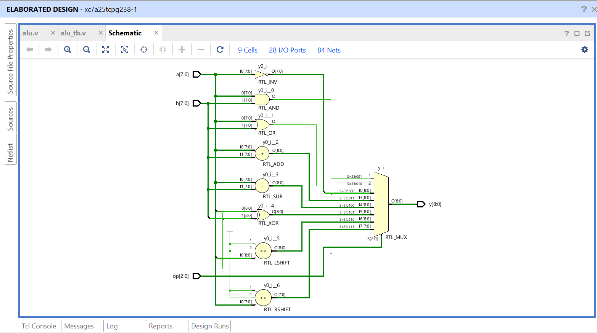
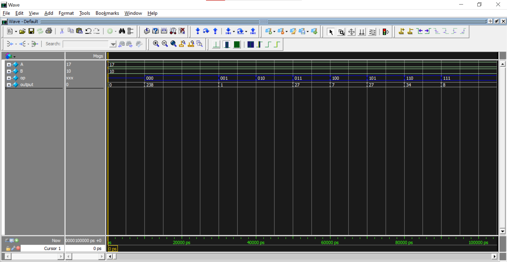

# 8-Bit ALU in Verilog (FPGA — Xilinx Artix-7)

An 8-bit Arithmetic Logic Unit (ALU) designed and simulated using Verilog HDL, synthesized on the **Xilinx Artix-7 (xc7a25tcpg238-1)** FPGA using **Vivado Design Suite**.

---

## 📁 Project Structure

```
ALU/
├── alu.v                    # ALU design module
├── alu_tb.v                 # Testbench for simulation
├── images/
│   ├── schematic.png        # RTL Elaborated Design schematic
│   ├── waveform.png         # Simulation waveform
│   └── console_output.png   # Simulation console output
└── README.md
```

---

## 🔌 Module Interface

```verilog
module alu(
    input  [7:0] a,    // 8-bit operand A
    input  [7:0] b,    // 8-bit operand B
    input  [2:0] op,   // 3-bit operation selector
    output reg [8:0] y // 9-bit output (handles carry/overflow)
);
```

| Port | Width | Direction | Description                              |
|------|-------|-----------|------------------------------------------|
| `a`  | 8-bit | Input     | First operand                            |
| `b`  | 8-bit | Input     | Second operand                           |
| `op` | 3-bit | Input     | Operation select (8 operations)          |
| `y`  | 9-bit | Output    | Result (extra bit for carry/overflow)    |

---

## ⚙️ Supported Operations

| `op`    | Operation     | Description                          |
|---------|---------------|--------------------------------------|
| `3'b000` | `NOT A`      | Bitwise NOT of operand A             |
| `3'b001` | `A AND B`    | Logical AND of A and B               |
| `3'b010` | `A OR B`     | Logical OR of A and B                |
| `3'b011` | `A + B`      | Arithmetic addition                  |
| `3'b100` | `A - B`      | Arithmetic subtraction               |
| `3'b101` | `A XOR B`    | Bitwise XOR of A and B               |
| `3'b110` | `A << 1`     | Left shift A by 1                    |
| `3'b111` | `A >> 1`     | Right shift A by 1                   |

---

## 🗺️ RTL Schematic (Elaborated Design)

The elaborated design in Vivado shows the full RTL structure with all logic blocks connected through an 8:1 multiplexer.



The design includes:

| Cell         | Function                                         |
|--------------|--------------------------------------------------|
| `RTL_INV`    | Bitwise NOT                                      |
| `RTL_AND`    | Logical AND                                      |
| `RTL_OR`     | Logical OR                                       |
| `RTL_ADD`    | Adder (9-bit output)                             |
| `RTL_SUB`    | Subtractor (9-bit output)                        |
| `RTL_XOR`    | XOR gate (9-bit output)                          |
| `RTL_LSHIFT` | Left shift by 1                                  |
| `RTL_RSHIFT` | Right shift by 1                                 |
| `RTL_MUX`    | 8:1 mux selecting output based on `op[2:0]`      |

> Synthesized with **9 Cells**, **28 I/O Ports**, **84 Nets**

---

## 🧪 Simulation Results

Testbench inputs: **A = 17 (0x11)**, **B = 10 (0x0A)**

| Time (ps) | `op`  | Operation   | Result `y` |
|-----------|-------|-------------|------------|
| 10000     | `000` | NOT A       | **238**    |
| 30000     | `001` | AND         | **1**      |
| 40000     | `010` | OR          | **1**      |
| 50000     | `011` | ADD         | **27**     |
| 60000     | `100` | SUB         | **7**      |
| 70000     | `101` | XOR         | **27**     |
| 80000     | `110` | LEFT SHIFT  | **34**     |
| 90000     | `111` | RIGHT SHIFT | **8**      |

### Waveform



### Console Output

```
time :          0 | a : 17  | b : 10 | op : x  | y : 0
time :      10000 | a : 17  | b : 10 | op : 0  | y : 238
time :      30000 | a : 17  | b : 10 | op : 1  | y : 1
time :      40000 | a : 17  | b : 10 | op : 2  | y : 1
time :      50000 | a : 17  | b : 10 | op : 3  | y : 27
time :      60000 | a : 17  | b : 10 | op : 4  | y : 7
time :      70000 | a : 17  | b : 10 | op : 5  | y : 27
time :      80000 | a : 17  | b : 10 | op : 6  | y : 34
time :      90000 | a : 17  | b : 10 | op : 7  | y : 8
```

---

## 🛠️ Tools Used

| Tool              | Details                              |
|-------------------|--------------------------------------|
| HDL               | Verilog (`IEEE 1364`)                |
| Simulator         | Vivado Simulator / GTKWave           |
| Synthesis Tool    | Xilinx Vivado Design Suite           |
| Target FPGA       | Xilinx Artix-7 `xc7a25tcpg238-1`    |
| Timescale         | `1ns / 1ps`                          |

---

## 🚀 How to Run

### Simulation in Vivado

1. Clone this repository:
   ```bash
   git clone https://github.com/your-username/ALU.git
   cd ALU
   ```
2. Open **Vivado** and create a new project.
3. Add `alu.v` as the design source and `alu_tb.v` as the simulation source.
4. Set `alu_tb` as the top module for simulation.
5. Run **Behavioral Simulation** → click **Run All**.
6. Observe output in the **TCL Console** and **Wave Viewer**.

### Synthesis

1. Set `alu` as the top module.
2. Run **Synthesis** and open the **Elaborated Design** to view the RTL schematic.

---

## 📌 Notes

- The output `y` is **9 bits wide** to correctly capture carry/borrow from addition and subtraction.
- Logical AND (`3'b001`) and OR (`3'b010`) use Verilog's scalar logical operators (`&&`, `||`), which return only `0` or `1` — not a bitwise result. If bitwise behavior across all 8 bits is needed, replace with `&` and `|`.
- In the testbench, `op = 000` is assigned twice at the start, causing `$monitor` to print the NOT result only once (at 10000 ps) since the signal value doesn't change on the second assignment — this explains the 20000 ps gap between the first and second printed lines.
- The `default` case drives the output to `0` for any undefined opcode.

---

## 📜 License

This project is open source and available under the [MIT License](LICENSE).
